<details><summary>Drop Down Menu</summary>

- [x] Markdown-Notizen
- [ ] Weitere Notizen
- [ ] Noch mehr Notizen

- Punkt 1
- Punkt 2
- Punkt 3

1. Erster Punkt
2. Zweiter Punkt
3. Dritter Punkt

**fett**

_kursiv_

`inline code`

> Blockquote


[Google](https://www.google.com)

---

\*Это звездочка\*

```python
def hello_world():
		print("Hello, World!")
```

</details>

## 1 VL: Einführung in die Computergrafik

##### [Graphikpipeline](./vorlesungen/CG1-1.pdf)

<details><summary>Def: Rendering</summary>

**Rendering** = das Erzeugen von Bildern ausgehend von 3D- oder 2D-Modellen

</details>

<details><summary>klassische Pipeline: feste Schritte, nicht programmierbar</summary>


- **Vertex / Index Buffer** - Rohdaten: Punkte und Dreiecke des 3D-Objekts
- **Input Assembly** - Aus den Rohdaten werden Primitive (Dreiecke) zusammengesetzt
- **Transformation & Beleuchtung** - Objekt in die richtige Position bringen + Licht berechnen
- **Rasterisierer** - Primitive in Pixel umwandeln
- **Texturierung** - Pixel bekommen Farbe aus einer Textur
- **Blending / z-Buffer** - Tiefentest (was ist vorne/hinten?) + Transparenz
- **Pixel Buffer** - Fertiges Bild wird ausgegeben
</details>

<details><summary>modern Pipeline: programmierbar, flexibel, ermöglicht komplexe Effekte</summary>


- **Vertex Shader** - Vertices transformieren (programmierbar)
- **Hull Shader** - wie stark soll die Fläche unterteilt werden? (berechnen der Parameter für den Tessellator)
- **Tessellator** - Fläche automatisch in viele kleine Dreiecke aufteilen
- **Domain Shader** - neue Vertex-Positionen nach Unterteilung berechnen (verschieben des Vertices)
- **Geometry Shader** - Primitive erzeugen/verändern/löschen
- **Pixel Shader** - finale Farbe jedes Pixels berechnen (Licht, Texturen, Effekte)
</details>

##### [Einführung in die OpenGL](./vorlesungen/CG1-2.pdf)

<details><summary>OpenGL ist eine "State-Machine"</summary>

- OpenGL speichert Informationen über den aktuellen Zustand (z.B. welche Texturen gebunden sind, welche Shader aktiv sind, etc.)
- State-Informationen bleibt über mehrere Primitive gleich, was die Datenreduktion ermöglicht
</details>

<details><summary>Strips und Fans</summary>

**Strips und Fans** sind Möglichkeiten, Dreiecke **effizienter** zu speichern und zu rendern. Nur noch **n+2** Vertices/Indices statt **3n**

- **Fans** = ein zentraler Vertex, von dem aus Dreiecke ausgehen (gut für Kreise oder andere symmetrische Formen)

```OpenGL: GL_TRIANGLE_FAN
p0 = hub (центр)
Dreieck(p0, p1, p2)
Dreieck(p0, p2, p3)
Dreieck(p0, p3, p4)
```

- **Strips** = 2 Dreiecke teilen sich eine Seite, um eine lange Kette von Dreiecken zu bilden (gut für Boden, Wände, etc.)

```OpenGL: GL_TRIANGLE_FAN
Dreieck(p0, p1, p2)
Dreieck(p2, p1, p3)  ← два предыдущих + новая
Dreieck(p2, p3, p4)
```


</details>

## 2 VL: Primitives

##### [Koordinatensysteme | Transformationen | Projektionen](./vorlesungen/CG1-3.pdf)

<details><summary>Koordinatensysteme: affine und lineare</summary>


- **lineare Koordinatensysteme**:
  - nur Rotation, Skalierung, aber keine Translation
  - Ursprung bleibt fest
- **affine Koordinatensysteme**:
  - zusätzlich Translation
  - Ursprung kann verschoben werden
  - ist ein Teilmenge der linearen Koordinatensysteme
  </details>

<details><summary>Baryzentrische Koordinaten</summary>


- BK = Koordinatensystem, bei dem die Position eines Punktes **relativ zu den Ecken eines Dreiecks** angegeben wird, nicht in einem absoluten XY-System
- `P = α·A + β·B + γ·C`
- Die Koeffizienten `α, β, γ` sind die baryzentrischen Koordinaten.
- Bedingung: `α + β + γ = 1` und alle drei ≥ 0 (wenn P innerhalb liegt)
</details>

<details><summary>Affine Abbildungen</summary>

Eigenschaften von affinen Abbildungen:

- Gerade bleibt Gerade
- Parallele Objekte bleiben parallel
- Verhältnisse von Längen bleiben erhalten (z.B. Mittelpunkt bleibt Mittelpunkt)
- Beschränkte Objekte bleiben beschränkt

> Eine Abbildung ist genau dann affin, wenn sie aus einer linearen Abbildung und einer Translation (Verschiebung) besteht. `Ф(v) = A(v) + d`

</details>

<details><summary>2D und 3D Transformationen</summary>

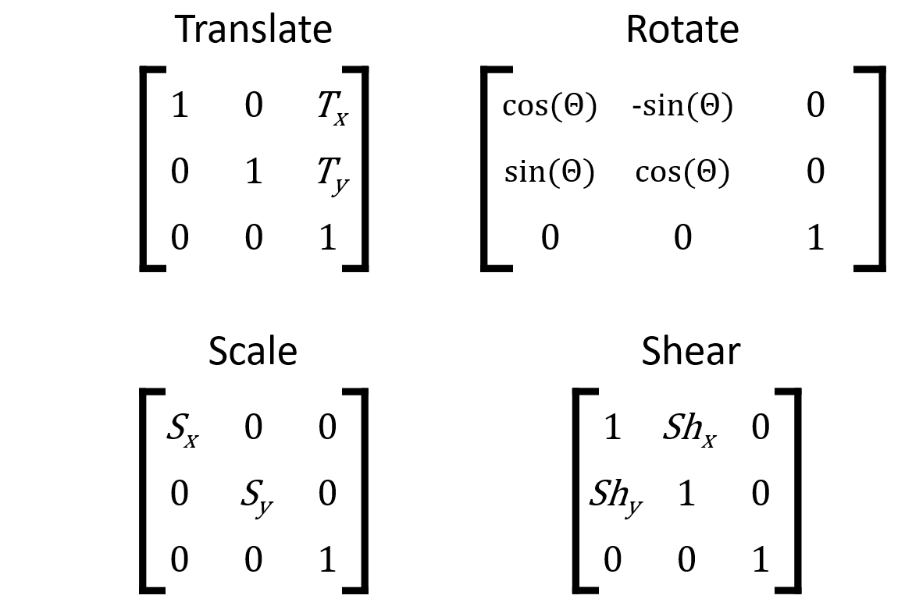

###### **Translation**
- **2D**: Verschiebung eines Objekts um einen Vektor `t = (tx, ty)`
- **3D**: ... `t = (tx, ty, tz)`

```
		T(tx, ty, tz) = [[1, 0, tx],
						 [0, 1, ty],
						 [0, 0, 1]]
```

###### **Rotation**
- **2D**: Drehung eines Objekts um einen Winkel `θ` (gegen den Uhrzeigersinn)
```
		R(θ) = [[cos(θ), -sin(θ)],
				 [sin(θ),  cos(θ)]]
```

- **3D**: ... um eine Achse (x, y oder z) um einen Winkel `θ`

```
		Rz(θ) = [[cos(θ), -sin(θ), 0],
				 [sin(θ),  cos(θ), 0],
				 [0,       0,      1]]
```
*Problem*:
1. zu klein oder zu großer Winkel kann zu numerischen Instabilitäten führen
2. Gimbal Lock (Verlust einer Rotationsfreiheit)

###### **Skalierung**
- **2D**: Vergrößerung oder Verkleinerung eines Objekts um Faktoren `sx` und `sy`

```
			S(sx, sy) = [[sx, 0],
						 [0, sy]]
```

- **3D**: ... und `sz`

```
				S(sx, sy, sz) = [[sx, 0, 0],
								 [0, sy, 0],
								 [0, 0, sz]]
```

###### **Shearing**
- **2D**: Verzerrung eines Objekts, z.B. horizontaler Shear mit Faktor `shx`

```
					  Sh(shx) = [[1, shx],
								 [0, 1]]
```

- **3D**:

```
					  Sh(shx) = [[1, s3, s5],
								 [s1, 1, s6],
								 [s2, s4, 1]]
```

</details>

<details><summary>Roll-Pitch-Yaw</summary>


- in der Luftfahrt verwendet, um die Orientierung eines Flugzeugs zu beschreiben
- in OpenGL:
  - **Roll** = z-Achse
  - **Pitch** = x-Achse
  - **Yaw/Head** = y-Achse
- `R = Rroll · Rpitch · Ryaw`. Die Reihenfolge ist umgekehrt zu der, in der die Rotationen angewendet werden (Yaw -> Pitch -> Roll) - [Крен, Тангаж, Рыскание](https://rcsearch.ru/wiki/%D0%9A%D1%80%D0%B5%D0%BD,_%D0%A2%D0%B0%D0%BD%D0%B3%D0%B0%D0%B6,_%D0%A0%D1%8B%D1%81%D0%BA%D0%B0%D0%BD%D0%B8%D0%B5)
</details>

<details><summary>Gimbal Lock</summary>

- GL = wenn zwei Rotationsachsen in einer Linie liegen, **verliert man eine Rotationsfreiheit**
- z.B. wenn Pitch +-90° ist, dann liegen Roll und Yaw auf der selben Achse, man kann nicht mehr zwischen ihnen unterscheiden
- Problem bei der Verwendung von **Euler-Winkeln** für die Rotation (3D-Rotation)
- Lösung: **Quaternionen** (4D-Rotation)
</details>

## 3 VL: Quaternionen

<details><summary>Quaternionen vs. Eulertransformationen</summary>

**Euler**:

- +: leicht zu implementieren
- -: Gimbal Lock (Verlust einer Rotationsfreiheit)
- -: inverses Problem (gleiche Rotation kann durch verschiedene Winkelkombinationen dargestellt werden, z.B. `90°, 0°, 0°` und `90°, 360°, 0°`)

**Quaternionen**:

- +: keine Unstetigkeit (kein Gimbal Lock)
- +: kein inverses Problem (jede Rotation hat eine eindeutige Darstellung)
- -: komplizierter

**Почему Quaternionen решают проблемы?**

- Gimbal Lock: Кватернион описывает поворот как одну операцию: ось + угол → `(x, y, z, w)`. Нет последовательных поворотов по X, Y, Z — значит оси никогда не совпадают.
- Inverses Problem: Кватернионы используют 4D-пространство для представления вращения, что позволяет однозначно описать каждую ориентацию.

**Аналогия:**

- Euler: как описывать местоположение через "иди 3 шага на север, потом 2 на восток" → порядок важен, можно запутаться.
- Quaternionen: как GPS-координаты → одна точка, однозначно, всегда.
</details>

<details><summary>Quaternionen</summary>

**Sinn:**
Quaternionen werden verwendet, um Drehungen im 3D-Raum darzustellen, da sie helfen, Probleme mit dem Gimbal Lock zu vermeiden und glatte Interpolationen zwischen Orientierungen zu ermöglichen.

**Geschichte:**  
Von Hamilton in 1833. Quaternionen - eine Erweiterung der komplexen Zahlen in einen 4D-Raum. `q = w + ix + jy + kz` mit imaginären Zahlen `i`, `j`, `k`.

**Rotationsformel (сендвич):**  
$$R_q P = q p q^{-1}$$
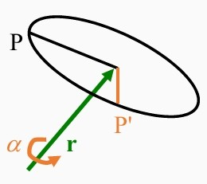

- `p` - das ist ein Vektor, dargestellt als Quaternion
- `q` - Einheitsquaternion, gebildet aus `(α, r)`, wo `a` - Winkel, `r` - Achse
- `q⁻¹` - inverse Quaternion, die für die Einheitsquaternion gleich ihrem konjugierten `(q*)` ist, also `q⁻¹ = q*`
- `P` - resultierender Punkt nach der Rotation
- `R_q` - die Rotation, die durch den Quaternion q beschrieben wird

**Multiplikation von Quaternionen:**
$$q₁q₂ = (w₁w₂ - r₁·r₂,  r₁×r₂ + w₁r₂ + w₂r₁)$$
Wann benutzt: Rotationen zu kombinieren (z.B. zuerst nach `α₁`, dann nach `α₂`, d.h. `q = q₂ · q₁`; `q₁` - первая, `q₂` - вторая, так как порядок умножения обратный к порядку применения)  
Wichtig: nicht kommutativ bei Multiplikation (`q₁q₂ != q₂q₁`)

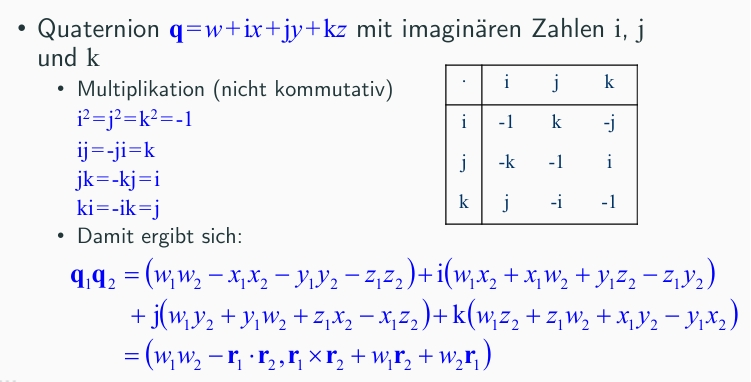

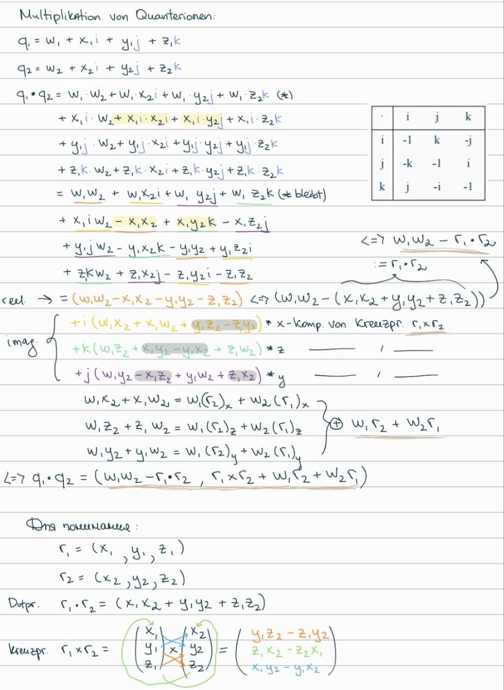

**Conjugation, Inverse, Norm:**  

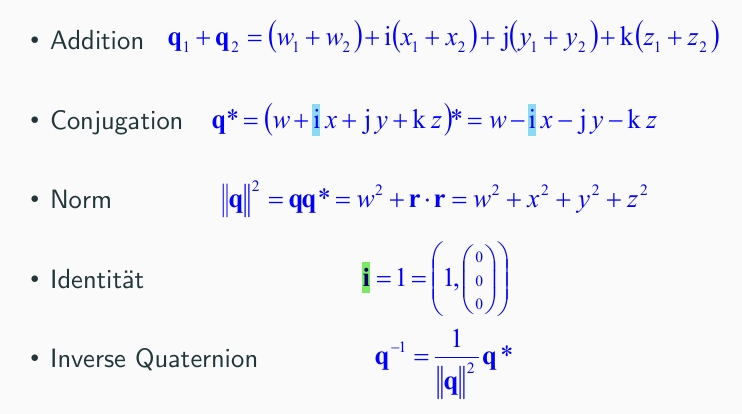
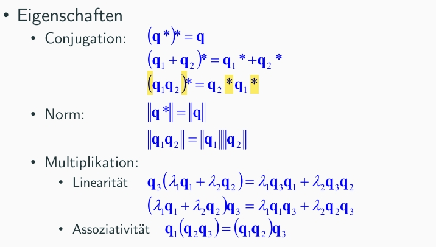

**Как происходят вычисления `q p q⁻¹`?**\
1. Берем Punkt P, который хотим повернуть, и представляем его как reine Quaternion `(0, P)`
- `P = (x, y, z) → p = (0, x, y, z) = 0 + ix + jy + kz`
2. Строишь `q` из `(α, r)`:
- `q = (cos θ,  rₓsinθ,  rᵧsinθ,  r_zsinθ) = (cos(α/2),  rₓsin(α/2),  rᵧsin(α/2),  r_zsin(α/2))`, т.к. `θ = α/2` (` <== p⊥r`)
3. Считаешь `q⁻¹`:
- `q⁻¹ = q* = (w, -x, -y, -z)`, т.к. единичный
4. Вычисляешь `p' = q p q⁻¹`:
- порядок важен
5. Quaternion `p'`, который можно снова представить как вектор `(0, P')`, где `P'` - повернутый вектор

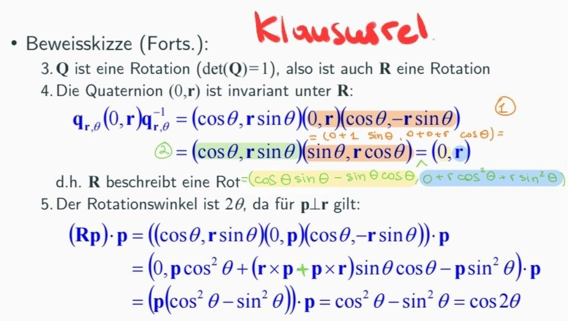

**Все важные шаги еще раз:**
1. θ = α/2
2. q = (cosθ, r·sinθ)
3. p = (0, P)
4. p' = q · p · q⁻¹
5. P' = xyz из p'

**Примеры, которые пока непонятны:**  
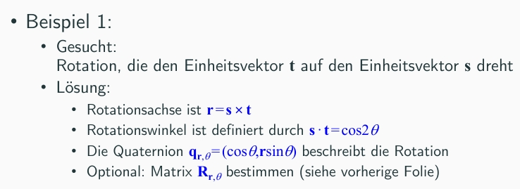
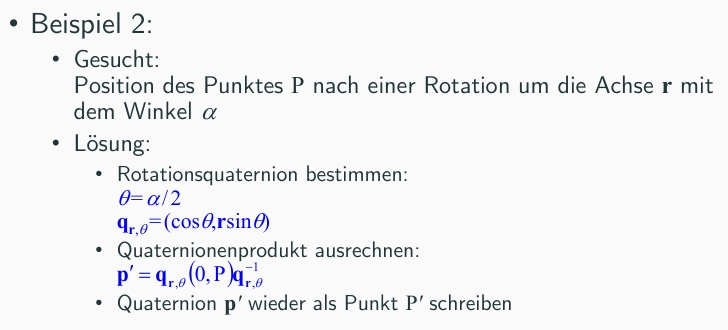
</details>

<details><summary>Trackball</summary>

- Interaktive Methode, um ein Objekt in 3D zu drehen
- Benutzer klickt und zieht mit der Maus, um das Objekt zu drehen, als ob er einen virtuellen Trackball um das Objekt herum dreht

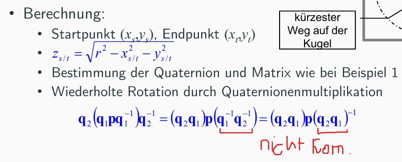

- Vorteile: intuitiv, einfach zu implementieren, ermöglicht freie Rotation in alle Richtungen
- Nachteile:
  - Gimbal Lock
  - Automatisch weiter drehen (Spinning Trackball)

</details>

<details><summary>Translation und homogene Koordinaten</summary>

### Translation = Verschiebung eines Objekts um einen Vektor `t = (tx, ty, tz)`

**Problem**: Translation **kann nicht** durch eine 3x3-Matrix dargestellt werden; bei Drehung/Rotation oder Skalierung kann  
Warum ist das wichtig? Weil wir alle Transformationen (Drehung, Skalierung, Translation) in einer einzigen Matrix kombinieren wollen, um sie effizient auf Punkte anzuwenden. 

**Решение: homogene Koordinaten**, а именно добавление четвертой координаты `(x, y, z)  →  (x, y, z, 1)`
<br/>

### Struktur der homogenen Koordinaten:  
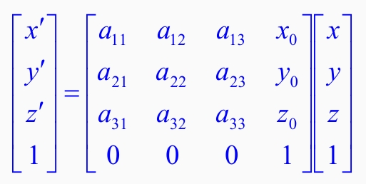

- oben links: 3x3-Matrix für Rotation/Skalierung
- oben rechts: 3x1-Vektor für Translation
- unten: (0, 0, 0, 1)

**Как в VL различать переход от normale к homogenen координат к наоборот?**
```
3D NK → 4D:  (x,y,z)   →  [x,y,z,1]
4D HK → 3D:  [x,y,z,1] →  (x,y,z)
```
<br/>

### Punkte vs Vektoren in HK:
- Punkt: `w = 1`
- Vektor: `w = 0`

_Beispiel:_
- Sei Punkte `A = (3, 5, 4)` und `B = (2, 7, 2)`
- in HK: `A = [3, 5, 4, 1]` und `B = [2, 7, 2, 1]`
- Vektor:  `v = A - B = [3-2, 5-7, 4-2, 1-1] = [1, -2, 2, 0]` (последний элемент всегда 0)

**Выводы:**
- Translation влияет только на точки `(w=1)`, не влияет на векторы `(w=0)`. Это логично, т.к. вектор это направление, а не конкретная позиция в пространстве.
</details>

## 4 VL: Sichtvolumen & Projektionen

<details><summary>Homogene Koordinaten: Translation = Scherung in w</summary>

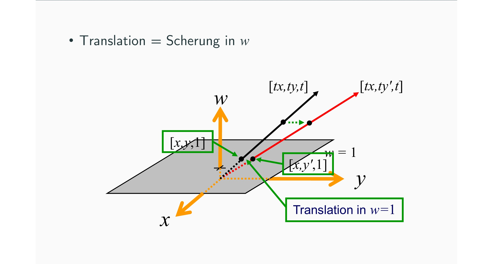

> **Translation = Scherung in `w`**: Verschiebt man `[x,y,1] → [x,y',1]`. Das erklärt, warum Translation durch die zusätzliche `w`-Dimension zu einer linearen Matrix wird.

</details>

<details><summary>Kanonisches Sichtvolumen & Bildschirmtransformation</summary>

- Objekte liegen innerhalb `[-1,1]³`
  
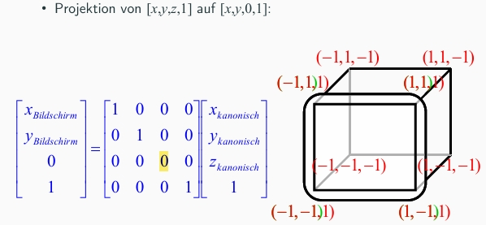

**Bildschirmtransformation** = kanonische in Pixelkoordinaten umwandeln:

$$
\begin{bmatrix}x_{Pixel}\\y_{Pixel}\\1\end{bmatrix} = \underbrace{\begin{bmatrix}1&0&\frac{n_x-1}{2}\\0&1&\frac{n_y-1}{2}\\0&0&1\end{bmatrix}}_{Translation}\underbrace{\begin{bmatrix}\frac{n_x}{2}&0&0\\0&\frac{n_y}{2}&0\\0&0&1\end{bmatrix}}_{Skalierung}\begin{bmatrix}x_{Bildschirm}\\y_{Bildschirm}\\1\end{bmatrix}
$$

</details>

<details><summary>Projektive Transformation & Orthographische Projektion</summary>

- Objekte liegen normalerweise **nicht** innerhalb `[-1,1]³`
- Die **projektive Transformation** bildet das (beliebige) Sichtvolumen auf das kanonische ab - bereitet die Projektion auf den Bildschirm vor
- Einfachster Fall: **orthographische Projektion** eines achsenparallelen Quaders `[l,r]×[b,t]×[n,f]` auf den kanonischen Würfel
- Ähnlich zur Bildschirmtransformation

$$
\begin{bmatrix}x_{kanonisch}\\y_{kanonisch}\\z_{kanonisch}\\1\end{bmatrix} = \underbrace{\begin{bmatrix}\frac{2}{r-l}&0&0&0\\0&\frac{2}{t-b}&0&0\\0&0&\frac{2}{n-f}&0\\0&0&0&1\end{bmatrix}}_{Skalierung}\underbrace{\begin{bmatrix}1&0&0&-\frac{l+r}{2}\\0&1&0&-\frac{b+t}{2}\\0&0&1&-\frac{n+f}{2}\\0&0&0&1\end{bmatrix}}_{Translation}\begin{bmatrix}x\\y\\z\\1\end{bmatrix}
$$

</details>

<details><summary>Betrachterposition und -richtung (Kamerakoordinatensystem)</summary>

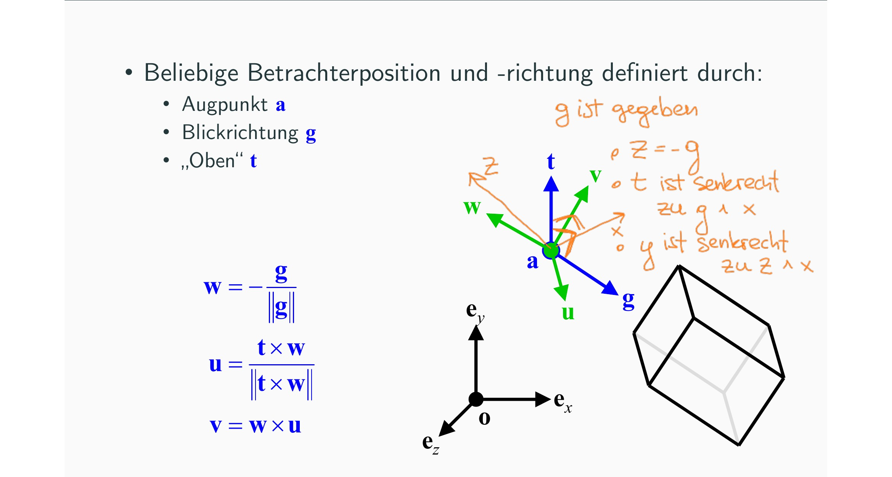

$$
\begin{bmatrix}u&v&w&a\\0&0&0&1\end{bmatrix}^{-1} = \underbrace{\begin{bmatrix}u^t&0\\v^t&0\\w^t&0\\0&1\end{bmatrix}}_{Rotation}\underbrace{\begin{bmatrix}1&0&0&-a\\0&1&0&-a\\0&0&1&-a\\0&0&0&1\end{bmatrix}}_{Translation} = \begin{bmatrix}u^t&-a\cdot u\\v^t&-a\cdot v\\w^t&-a\cdot w\\0&1\end{bmatrix}
$$

</details>

<details><summary>Hierarchie von Projektionen</summary>

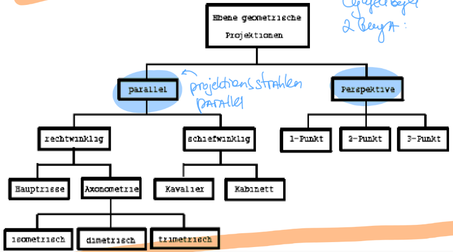  

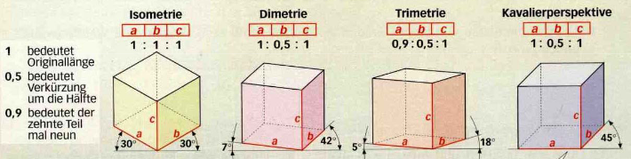

</details>

<details><summary>Parallelprojektion allgemein</summary>

- +: Projektionsstrahlen sind alle parallel → einfach zu berechnen und es gut für technische Zeichnungen; Parallelität/Verhältnisse bleiben erhalten
- -: weniger natürlich als Perspektive (keine Verkürzung mit der Entfernung)

</details>

<details><summary>Rechtwinklige Projektionen (orthogonale Parallelprojektion)</summary>

- Projektionsrichtung steht **senkrecht** auf der Projektionsebene

**Beispiel**:

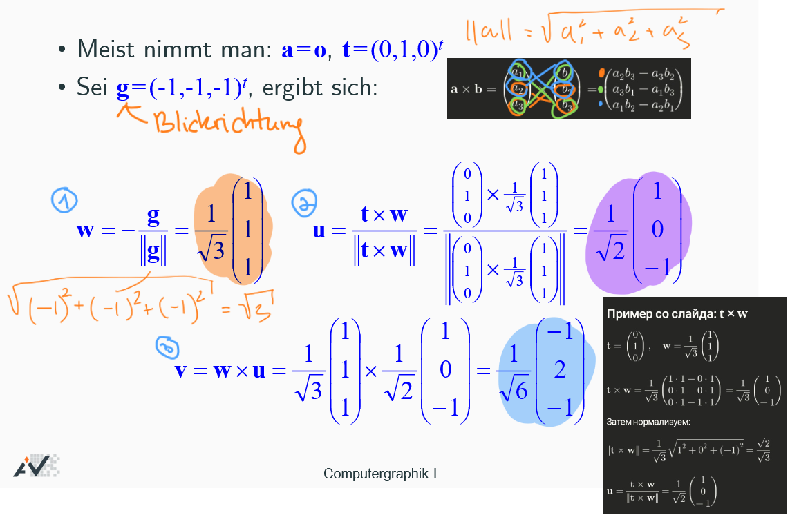  
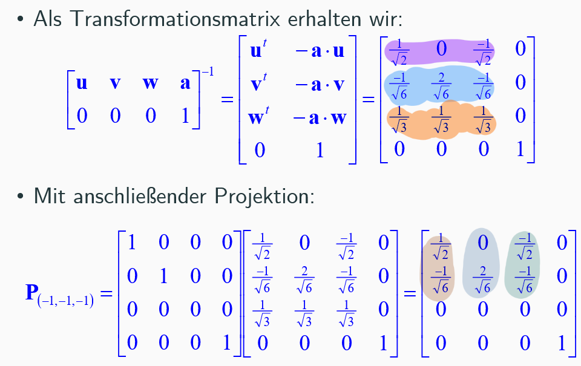  
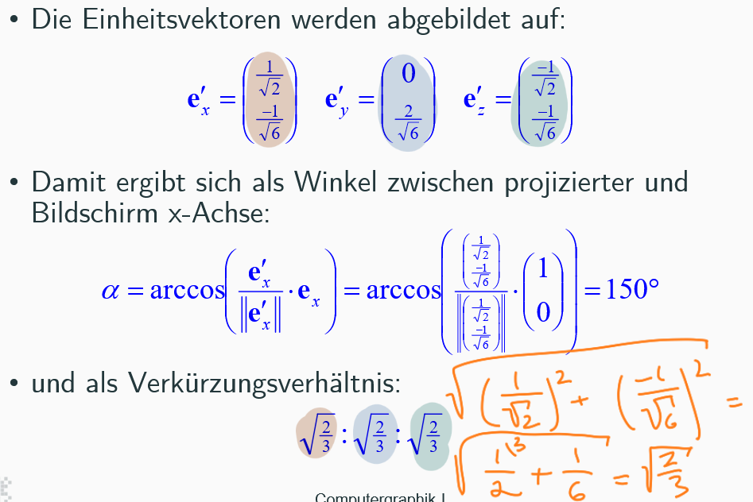

</details>

<details><summary>Schiefwinklige Projektionen (Kavalier- und Kabinettprojektion)</summary>

- **Projektionsrichtung steht NICHT senkrecht** zur Projektionsebene
- Projektionsebene meist parallel zu 2 Koordinatenachsen (z.B. xy-Ebene)

`g = (-cosα·cosβ,  -sinα·cosβ,  -sinβ)`

- Matrix = **Scherung** in der xy-Ebene + Parallelprojektion entlang z:

$$
P = \begin{bmatrix}1&0&-\frac{\cos\alpha}{\tan\beta}&0\\0&1&-\frac{\sin\alpha}{\tan\beta}&0\\0&0&0&0\\0&0&0&1\end{bmatrix}
$$

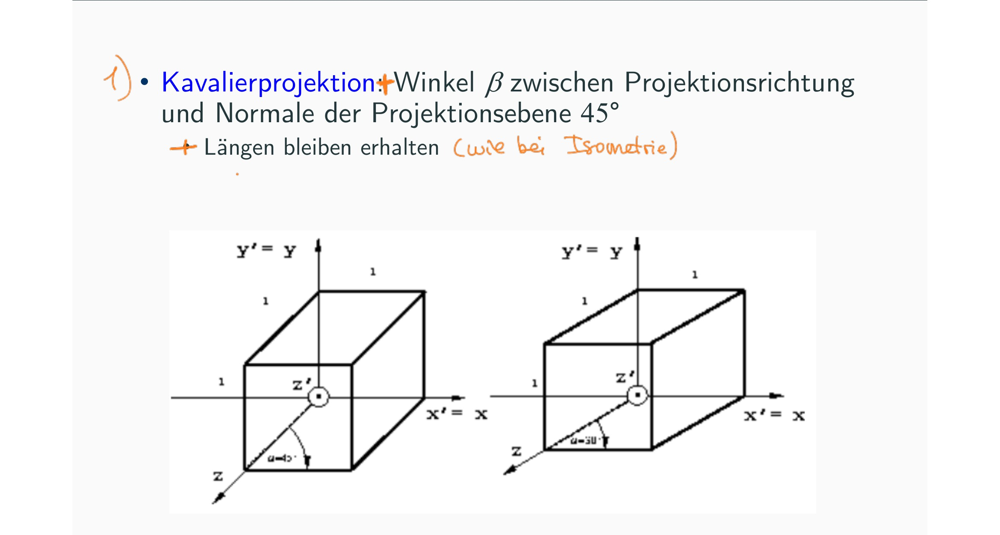

1. **Kavalierprojektion**: `β = 45°` → Längen entlang der Projektionsrichtung bleiben **erhalten** (wie bei Isometrie) → Objekte wirken gestreckt/unnatürlich

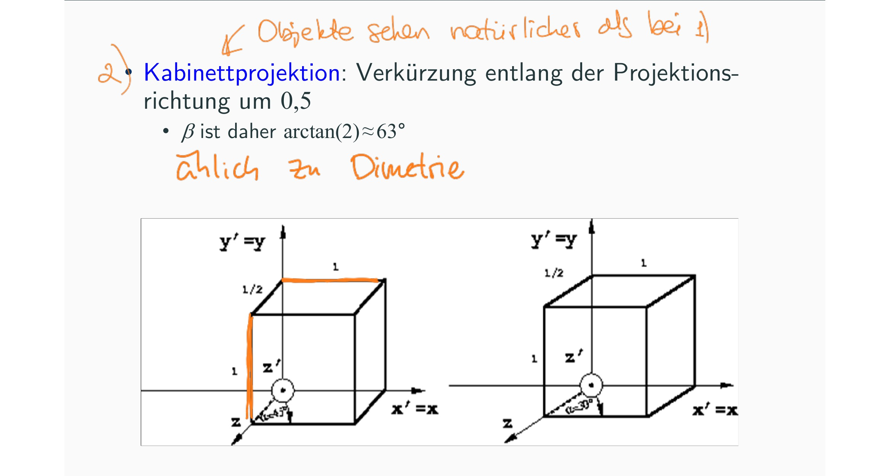

2. **Kabinettprojektion**: Verkürzung entlang der Projektionsrichtung um `0.5` → `β = arctan(2) ≈ 63°` (ähnlich zu Dimetrie) → Objekte sehen **natürlicher** aus als bei Kavalier
</details>

<details><summary>Perspektive</summary>

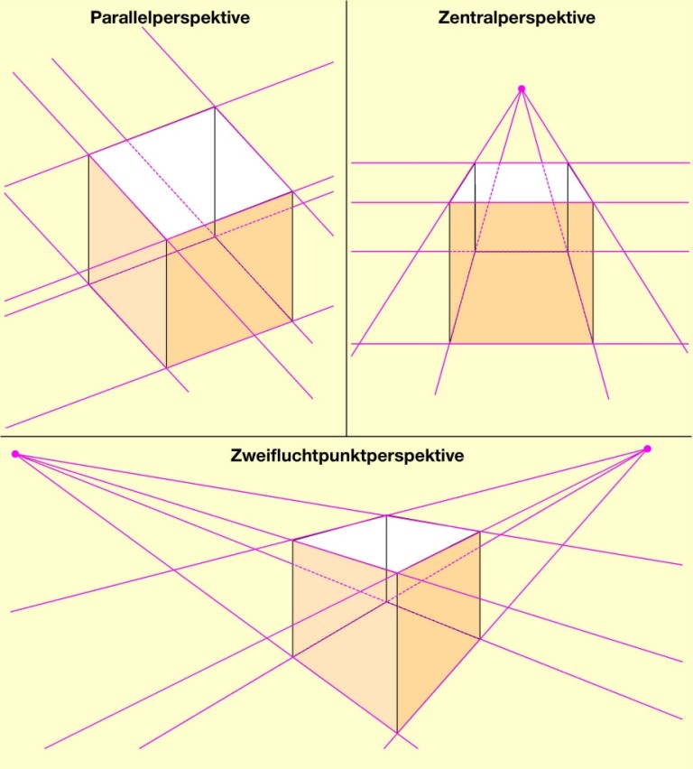

> Perspektivische Projektion ist **keine affine Abbildung** mehr (Parallelen treffen sich im Fluchtpunkt)

</details>

## 5 VL

<details><summary>Eigenschaften projektiver Abbildungen</summary>

- Projektive Abbildungen in `P(ℝ⁴)` sind lineare Abbildungen (Matrizen) in `ℝ⁴`
- **Geraden werden auf Geraden abgebildet**
- Reihenfolge und **Doppelverhältnis** von Punkten auf einer Geraden bleiben erhalten
- Perspektivische Abbildungen = spezielle projektive Abbildungen, aber **nicht affin**

</details>

<details><summary>Perspektivische Abbildung: Herleitung (2D)</summary>

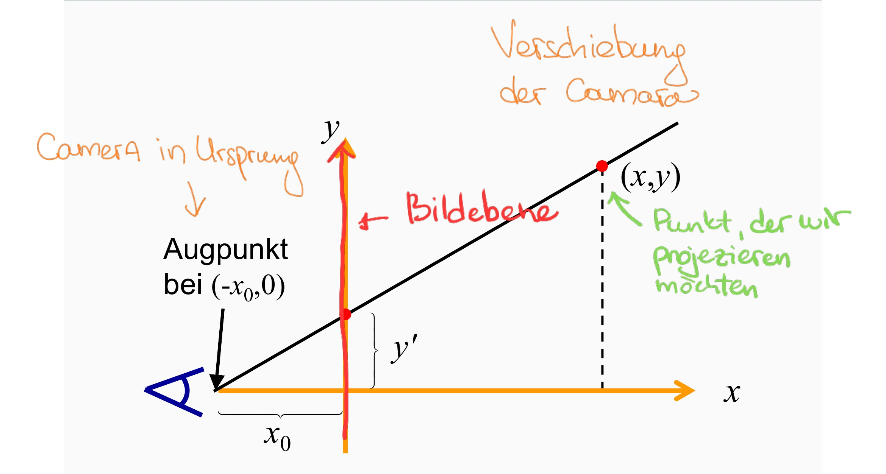

`(x,y) ↦ (0, x0/(x+x0)·y)` — nicht affin (Division durch `x+x0`)

homogene Matrix (Scherung + Standardprojektion):

$$
\begin{bmatrix}x\\y\\1\end{bmatrix} \mapsto \begin{bmatrix}0&0&0\\0&1&0\\\frac{1}{x_0}&0&1\end{bmatrix}\begin{bmatrix}x\\y\\1\end{bmatrix}
$$

</details>

<details><summary>Fluchtpunkte</summary>

- Augpunkt `(-x0,0)` → `(-∞,0)`
- `(+∞,0)` → Fluchtpunkt `(x0,0)`
- Fächer aus Linien ↔ parallele Linien (jeweils Umkehrung voneinander)

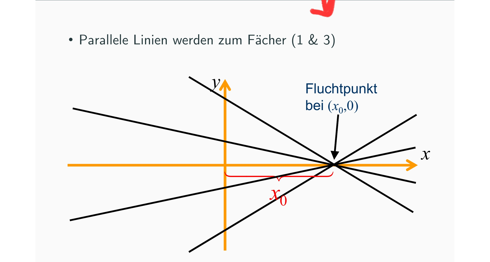

</details>

<details><summary>Sichtfrustum & Grenzfall</summary>

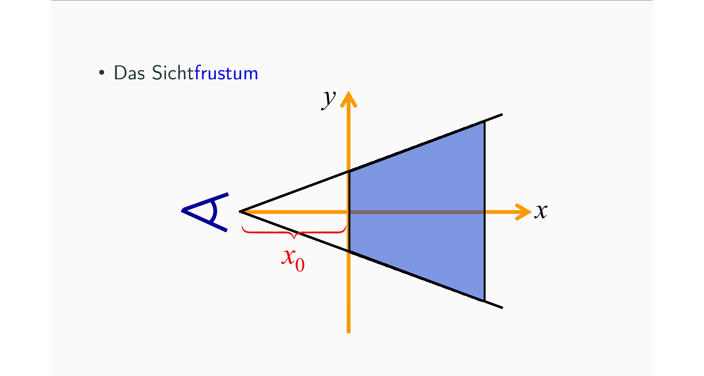

- für `x0 → ∞` wird die perspektivische Projektion zur **orthogonalen** Projektion

</details>

##### [Clipping | Rasterisierung | Anti-Aliasing](./vorlesungen/CG1-4.pdf)

<details><summary>Liang-Barsky-Algorithmus</summary>

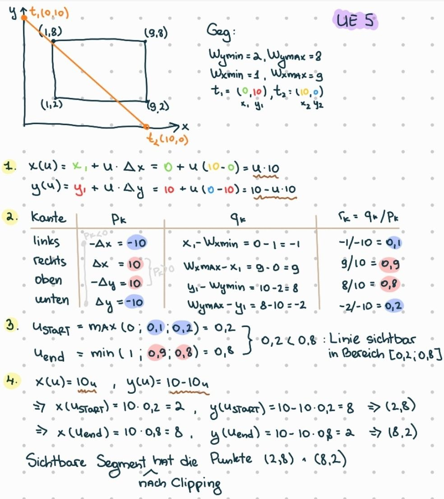

</details>

<details><summary>Cohen-Sutherland-Algorithmus</summary>

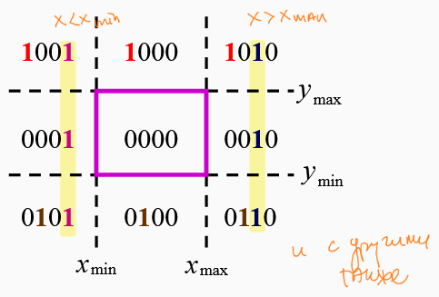

- Gut für Extremfälle, wenn die Enscheidung trivial ist
- пример на S.11 - 25

</details>

<details><summary>Sutherland-Hodgman-Algorithmus</summary>

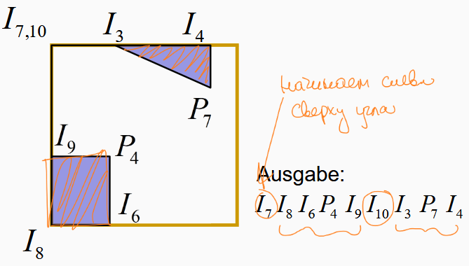

- пример на S.41 - 49

</details>

## 6 VL

<details><summary>Bresenham-Algorithmus</summary>

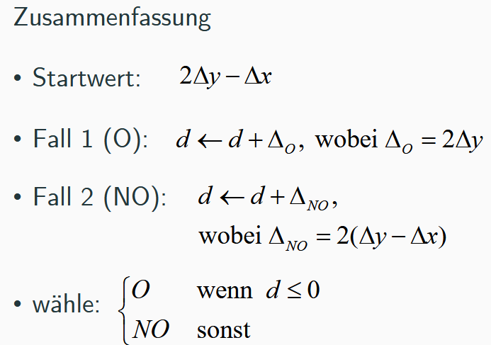  
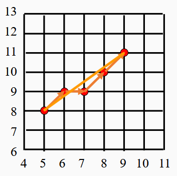

- пример на S.104 - 115

</details>

<details><summary>Gupta-Sproull-Algorithmus = Erweiterung von Bresenham</summary>

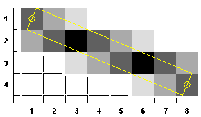

Gupta-Sproull ist eine Erweiterung von Bresenham, die **Anti-Aliasing ermöglicht**. Anstatt nur den Pixel zu zeichnen, der am nächsten an der idealen Linie liegt, zeichnet Gupta-Sproull auch die **benachbarten Pixel** darüber und darunter, aber **mit reduzierter Helligkeit**, abhängig von ihrem Abstand zur idealen Linie.

$$D = \frac{d \pm \Delta x}{2\sqrt{\Delta x^2 + \Delta y^2}}$$

</details>

<details><summary>Füllenpolygon -> Scanline Algorithmus</summary>

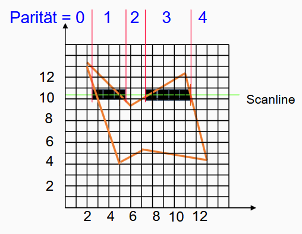

**Idee**: Polygon zeilenweise (Scanline für Scanline) durchlaufen, pro Zeile wird bestimmt, welche Pixel innerhalb liegen

**Ablauf pro Scanline:**
1. Finde alle Schnittpunkte der Scanline mit den Kanten des Polygons
2. Sortiere Schnittpunkte nach `x`
3. Fülle Pixel paarweise zwischen den Schnittpunkten (1.-2., 3.-4., ...)

**Paritätsregel** (so wird "innen" erkannt, ohne pro Pixel zu testen):
- Parität startet bei `0`
- an jedem Schnittpunkt wird Parität um 1 erhöht
- gefüllt wird, wenn Parität **ungerade** ist

</details>

<details><summary>Füllenpolygon -> Pineda Algorithmus</summary>

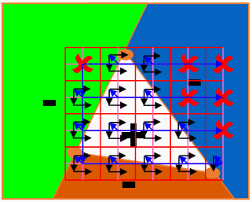

**Grundidee**: Rasterisierung eines konvexen Polygons = Clipping der Pixel an allen Kanten gleichzeitig. Dreiecke sind immer konvex → ideal für Dreiecksrasterisierung (GPU-Standardverfahren)

</details>

## 7 VL

<details><summary>Supersampling vs. Multisampling</summary>

Supersampling und Multisampling sind zwei Anti-Aliasing-Techniken **gegen Treppeneffekte** in 3D-Grafiken. Beide Methoden basieren auf der **Idee, mehrere Samples pro Pixel zu verwenden**, um eine glattere Darstellung zu erreichen, **unterscheiden** sich jedoch in der Art und Weise, **wie diese Samples generiert und verarbeitet werden**.

**SSAA**:
- Rendert **das gesamte Bild intern** in höherer Auflösung
- **Qualität: sehr gut**
- **Performance: sehr teuer**

**MSAA (erweiterte Supersampling)**:
- Verarbeitet **nur die Kanten**
- **Qualität: gut** für Geometrie, Textur-Aliasing bleibt unberührt
- **Performance: effizienter** als SSAA, da weniger Samples berechnet werden müssen
- Heufiger verwerdet

</details>

##### [Sichtbarkeitsalgorithmen | Culling](./vorlesungen/CG1-5.pdf)

<details><summary>Painter’s Algorithmus</summary>

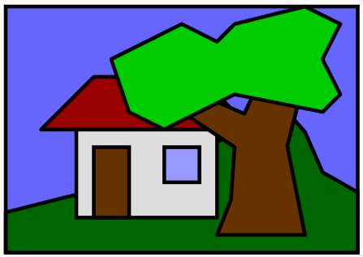

- Idee: Zeichne Bild wie ein Maler **von hinten nach vorne**
- Probleme:
  1. Sortieren hat **O(n*logn)** Laufzeit
  - Lösung: BSP-Bäume  
  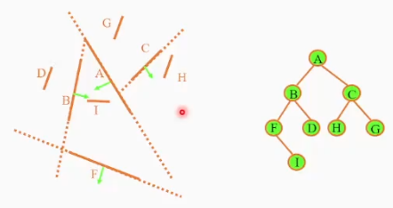
  2. **Zyklische Überlappungen**
  - Lösung: Clipping (Polygon in mehrere Teile aufteilen)  
  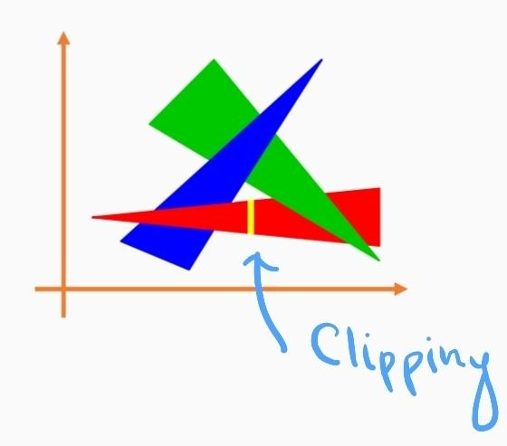

1. und 2. können kombiniert werden, um die Probleme zu lösen:
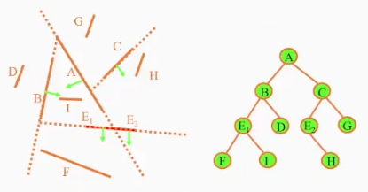
</details>

<details><summary>Z-Buffer-Algorithmus - Punktorientierte Algorithmen</summary>

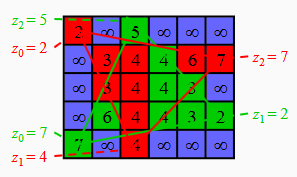

- Idee: Für jeden Pixel wird **die Tiefe (z-Wert)** gespeichert, um zu entscheiden, welcher Pixel sichtbar ist + **Farbe**.
- Vorteile: 
	- Einfach zu implementieren
	- Keine Sortierung der Polygone nötig
	- Funktioniert auch bei **Zyklischen Überlappungen**
- Nachteile:
	- Test für jeden Pixel nötig
	- keine Transparenz
	- Genauigkeit ist begrenzt

**Ablauf:**
1. **Initialisierung**:
   - Bildspeicher wird mit der Hintergrundfarbe befüllt.
   - Z-Speicher wird mit dem maximalen Z-Wert (`∞`) initialisiert.

2. **Rastern aller Primitive** in beliebiger Reihenfolge (keine Sortierung notwendig).

3. **Für jeden Punkt (x, y) eines Primitivs**:
   - Berechne den Z-Wert `z(x, y)` durch **lineare Interpolation** auf dem perspektivisch transformierten Dreieck.
   - Vergleich: Ist `z(x, y) < z_buf(x, y)`? (Ist der aktuelle Punkt näher als der bisher gespeicherte?)
     - **Ja**:  `z_buf(x, y) := z(x, y)` und `pixel(x, y):= farbe`.
     - **Nein**: Pixel ist verdeckt = keine Änderung.
</details>

## 8 VL

<details><summary>Modifikation: Hierarchischer Z-Buffer (HZB) / Z-Pyramide</summary>

Statt jeden Pixel einzeln zu testen, wird aus dem Z-Buffer eine Pyramide gebaut:
- Höchste Ebene = normaler Z-Buffer
- Jede höhere Ebene fasst 4 Pixel zusammen → speichert den **maximalen Z-Wert**
- Test: Wenn z_min des neuen Objekts > z_Block → Objekt ist komplett verdeckt → gesamter Block wird verworfen

Vorteil: nur die **sichtbaren Teile** der Szene werden gerendert, was die Leistung verbessert.

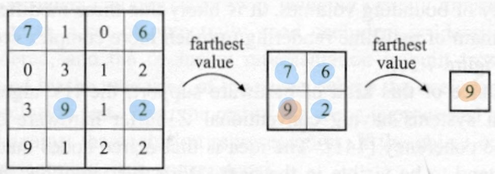

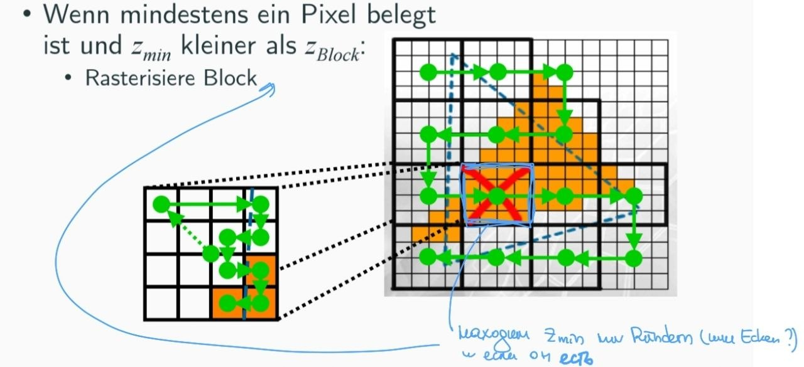

</details>

<details><summary>Culling</summary>

Culling-Algorithmen werden verwendet, um **nicht sichtbare Objekte** aus der Rendering-Pipeline zu entfernen, bevor sie auf dem Bildschirm gezeichnet werden. Dies spart Rechenleistung und verbessert die Performance.

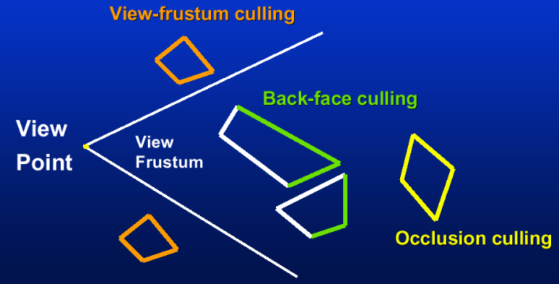

- **View-Frustum Culling** – verwirft Objekte außerhalb des Sichtfrustums; früh auf der CPU; einfachster Typ
- **Back-face Culling** – verwirft Rückseiten von Polygonen; GPU, nach Vertex-Transformation; mittlerer Aufwand
- **Occlusion Culling** – verwirft Objekte hinter anderen Objekten; spät (z.B. HZB); aufwendigster Typ
</details>

<details><summary>Back-face Culling: Skalarprodukt-analyse</summary>

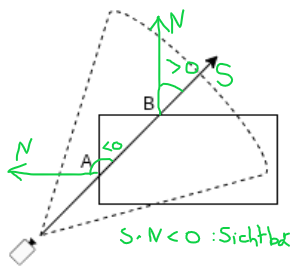

- S = Sehstrahl, N = Normalenvektor der Fläche
- S·N < 0 → Fläche **sichtbar**
- S·N ≥ 0 → Rückseite → **verwerfen**

Im Bild: Fläche A ist sichtbar (S·N < 0), Fläche B ist eine Rückseite (S·N ≥ 0) → wird verworfen.

</details>

<details><summary>Methoden für View-Frustum</summary>

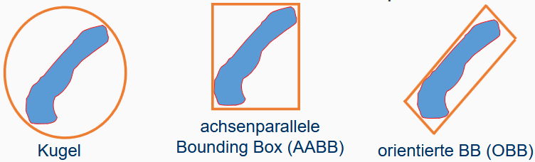

1. **Kugel** – einfachster Test, ungenau
2. **AABB** (achsenparallele Bounding Box) – kein Rotationsaufwand, einfach
3. **OBB** (orientierte Bounding Box) – genauester Fit, aufwendigster Test

**Beste Methode für GPU: AABB** – einfach zu berechnen, gut parallelisierbar.

Außerdem: Raumunterteilung mit Grids, Octrees oder Bäumen:

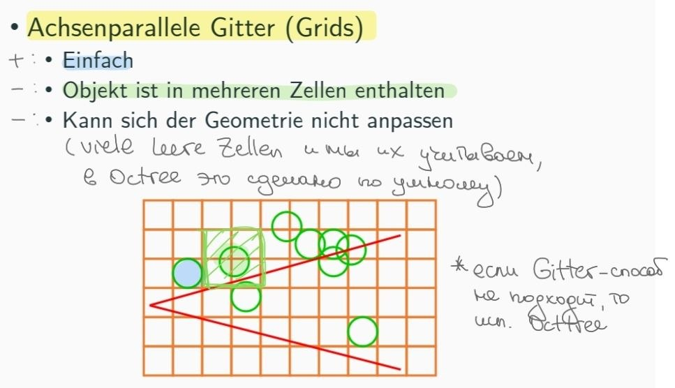

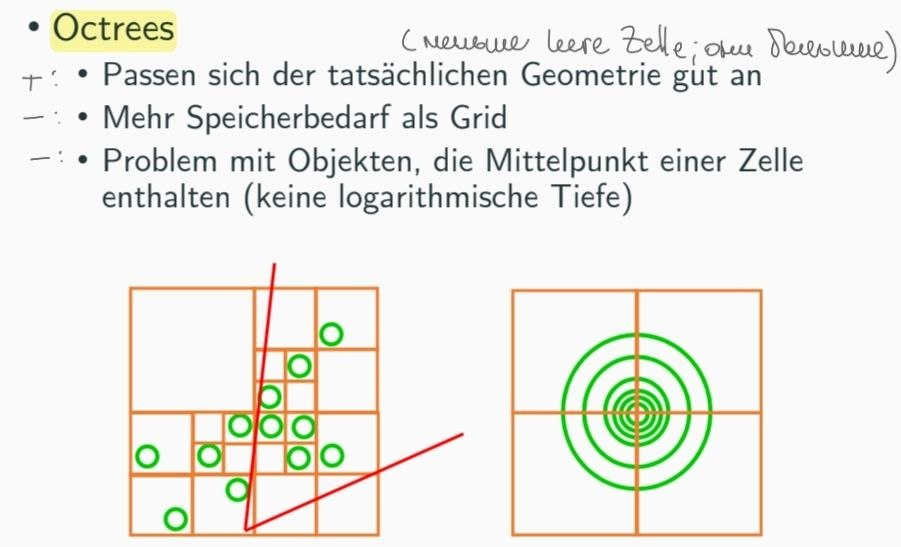

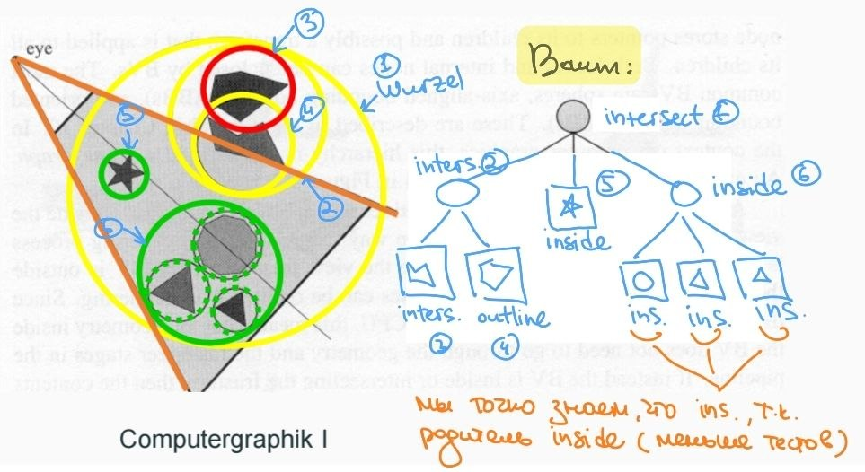

</details>

<details><summary>View-Frustum: Hüllkörperhierarchien (Bounding-Volume-Hierarchien
/ BVH)</summary>

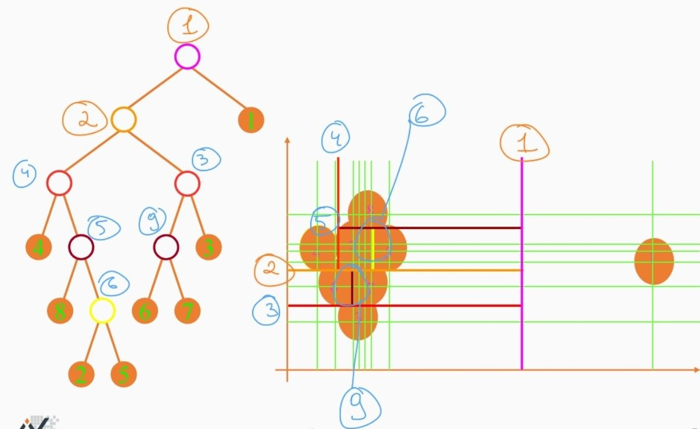

- Baum aus Hüllkörpern (z.B. AABB/Kugel), die Gruppen von Objekten umschließen
- Zweck: bei Schnitttests (z.B. View-Frustum Culling) ganze Objektgruppen auf einmal verwerfen, statt jedes Objekt einzeln zu testen
- gute Hierarchie = logarithmische Tiefe (balancierter Baum) + minimale Gesamtoberfläche der Hüllkörper
- optimale Hierarchie ist O(eⁿ) → zu teuer, daher **Greedy-Algorithmus** (baut gute kD-Baum-Hierarchie in O(n log n))

</details>

## 9 VL

<details><summary>Occlusion Culling: Zellen und Portale</summary>

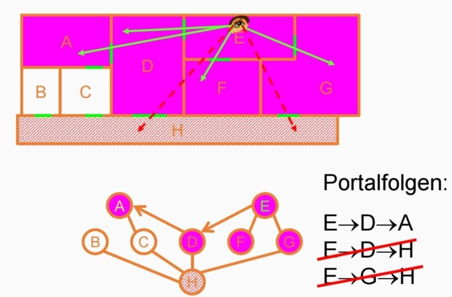

Weitere Optimierung: bestimmte Zellen von bestimmte Zelle werden niemals sichtbar (z. von H nach F) → **Speichere zu jeder Zelle alle Zellen, die möglicherweise eingesehen werden können**.

</details>

<details><summary>Hierarchisches Occlusion Culling</summary>

- **Hierarchisches Occlusion Culling** = Kombination von **Occlusion Culling** und **Hierarchie** (z.B. HZB oder BVH)
- Idee: Teste zuerst große Blöcke (von vorne nach hinten), wenn ein Block **vollständig verdeckt** ist, werden alle Kinder dieses Blocks verworfen → spart viele Tests

</details>

<details><summary>Hardware-Occlusion-Culling</summary>

**1. Occlusion Culling Flag** — nur Ja/Nein-Flag, vendor-spezifisch, kein Feedback

**2. HP Occlusion-Test** — testet Bounding Box gegen Tiefenpuffer, binäres Ergebnis, aber **synchron** → CPU wartet auf GPU (Pipeline Stall)

**3. ARB Occlusion-Query** — standardisiert, **asynchron**, liefert genaue Pixelanzahl statt nur Flag

</details>

<details><summary>Aggressives approximatives Culling</summary>

- Idee: Culling muss nicht 100% korrekt sein — kleine Fehler im Bild sind oft unsichtbar, dafür deutlich schneller
- **Pessimistischer Ansatz** (konservativ): Objekt zeichnen, sobald **irgendein** Pixel des Hüllkörpers sichtbar ist (Query ≠ 0) → Nachteil: Hüllkörper ist größer als Objekt, oft sichtbar ohne dass Objekt selbst sichtbar ist → unnötige Draws
- **Aggressiver Ansatz**: Objekt nur zeichnen, wenn **mindestens n** Pixel des Hüllkörpers sichtbar sind (Query ≥ n) → ignoriert kaum sichtbare Objekte, aber kann kleine Löcher im Bild erzeugen

</details>

## 9 VL

##### [Beleuchtungsmodelle und Texturen](./vorlesungen/CG1-6.pdf)

<details><summary>Beleuchtungsmodell und Typen</summary>

Beleuchtungsmodell = Berechnung der Farbe und Helligkeit eines Pixels; beeinflusst durch Lichtquellen (Position, Intensität, Farbe) und Objektoberfläche (Geometrie, Reflexionseigenschaften).

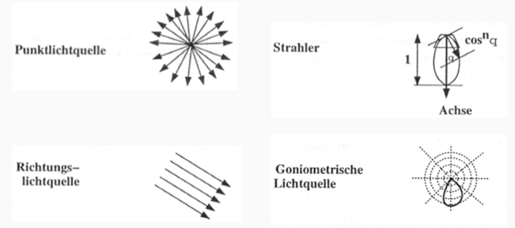

</details>

<details><summary>Superpositionprinzip</summary>

- Betrachtet man Licht als Teilchen, addieren sich die Beiträge **mehrerer Lichtquellen** einfach auf:

$$L(\lambda) = \sum_j L_j(\lambda)$$

- `L_j(λ)` hängt jeweils von der Bestrahlungsstärke `E_j(λ)` und der Reflektanz ab

</details>

<details><summary>Ideal Diffuse Reflexion vs. Ideal Spiegelnde Reflexion vs. BRDF (Bidirectional Reflective Distribution Function)</summary>

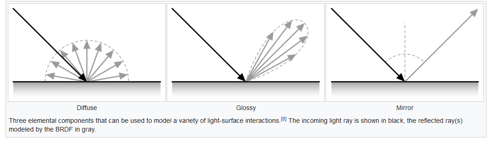

**Ideal Diffuse Reflexion** — mattes Material:
- Licht trifft auf die Oberfläche und wird **in alle Richtungen gleichmäßig** gestreut
- die Oberfläche erscheint gleich hell
- die Helligkeit hängt nur davon ab, **wie schräg** das Licht einfällt (Lambertsches Cosinusgesetz: je flacher, desto dunkler)

**Ideal Spiegelnde Reflexion** — perfekter Spiegel:
- Licht wird in **genau eine** Richtung reflektiert
- Einfallswinkel = Ausfallswinkel (`θ_r = θ_i`)
- Einfallsstrahl, Ausfallsstrahl und Flächennormale liegen in **einer Ebene**

**BRDF (Bidirectional Reflective Distribution Function):**
- Mathematisches Modell, das beschreibt **wie viel Licht** aus Richtung `ω_i` in Richtung `ω_r` reflektiert wird
- Eingabe = Einfallsrichtung + Ausfallsrichtung → Ausgabe = Reflexionsstärke
- Eigenschaften:
  - **Reziprozität** — Einfalls- und Ausfallsrichtung sind symmetrisch
  - **Energieerhaltung** — reflektiertes Licht kann nicht mehr sein als einfallendes
  - **Anisotropie** — manche Materialien reflektieren unterschiedlich je nach Drehung der Oberfläche

</details>

<details><summary>Vereinfachende Annahmen der BRDF</summary>

Die BRDF beschreibt nicht alle physikalischen Effekte. Sie nimmt an:

1. **Gleiche Wellenlänge**: Reflektiertes Licht hat dieselbe Farbe wie einfallendes Licht → keine **Fluoreszenz** (Material wandelt Licht nicht in eine andere Farbe/Wellenlänge um)
2. **Sofortige Reflexion** — das Licht verlässt die Oberfläche unmittelbar:
   - kein **Phosphoreszenz** — Oberfläche speichert keine Energie und leuchtet nicht nach
   - kein **Subsurface Scattering** — Licht dringt nicht ins Material ein

</details>

<details><summary>Aus welchen zwei Teilen besteht ein Beleuchtungsverfahren?</summary>

1. **Beleuchtungsmodell**: beschreibt den Zusammenhang zwischen Lichtquellen und
   Oberflächen und berechnet daraus die **Leuchtdichte in einem einzelnen Punkt**.
2. **Beleuchtungsalgorithmus** (Shading Algorithm): berechnet ausgehend von der
   Leuchtdichte in einigen wenigen Punkten die **Farbe aller Bildpunkte** (Pixel)
   des Bildes.

Die Kombination von Beleuchtungsmodell und Beleuchtungsalgorithmus heißt
Beleuchtungsverfahren.

</details>

<details><summary>Flat / Gouraud / Phong Shading</summary>

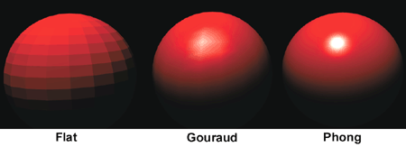

**Flat Shading**
- ein Farbwert pro Polygon (Beleuchtung mit Flächennormale, einmalig berechnet)
- \+ sehr schnell
- \- Kanten bleiben sichtbar, Objekt wirkt grob/facettiert

**Gouraud Shading**
- Beleuchtung nur an den Eckpunkten, Farbwerte werden interpoliert
- \+ günstiger als Phong (Beleuchtung nur pro Vertex statt pro Pixel)
- \- Glanzlichter (spekular) gehen zwischen den Eckpunkten verloren

**Phong Shading**
- Normale wird interpoliert und renormiert, Beleuchtung pro Pixel neu berechnet
- \+ glatte, korrekte Glanzlichter (auch spekular)
- \- rechenintensiver (Beleuchtung pro Pixel statt pro Vertex)

</details>

<details><summary>Lichtquellen (basierend auf dem Superpositionsprinzip) des Phong-Modells und Problem, das Blinn-Phong löst</summary>

**Superpositionsprinzip:** Licht wird wie Teilchen behandelt, Beiträge mehrerer
Lichtquellen addieren sich einfach.

**Lichtquellen im Phong-Modell:** verwendet werden **Punktlichtquellen**. Für jede der *n* Punktlichtquellen wird ein eigener diffuser +
spekularer Beitrag berechnet und (zusammen mit einem einmaligen ambienten
Anteil) aufsummiert:

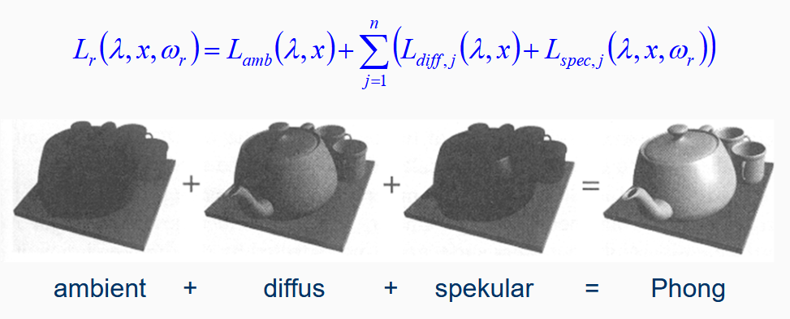

**Problem im Phong-Modell:** Für das Glanzlicht muss zuerst der
Reflexionsvektor `R` berechnet werden (die Richtung, in die der Lichtstrahl von der Fläche abprallt: `R = 2(N·L)N - L`).  
1. teuer: pro Pixel eine zusätzliche Normalisierung nötig
2. bei streifendem Lichteinfall kann der Winkel zwischen `V` und `R` > 90° werden → Glanzlicht bricht unnatürlich abrupt ab

**Lösung von Blinn-Phong:** statt `R` nehmen Halfway-Vektor `H = (L+E)/‖L+E‖` (Mitte aus Licht- und
Blickrichtung). Das Löst beide Probleme.

**Beispiel (Sonne im See):**
- Phong-Modell → rundes, isoliertes Glanzlicht (unrealistisch)
- Blinn-Phong-Modell → länglicher, zum Horizont gestreckter Streifen (entspricht der Realität)

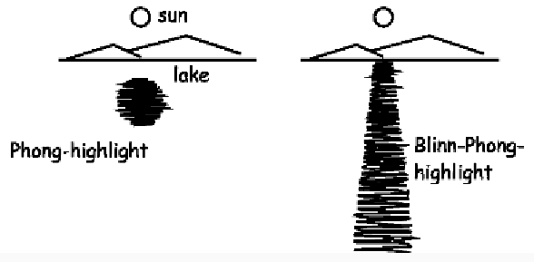

</details>

## 10 VL

<details><summary>Probleme des Phong/Blinn-Phong-Modells, die das LaFortune-Modell löst</summary>

Die BRDF von Phong/Blinn-Phong hat zwei Probleme:

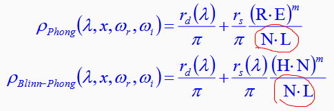

**1. keine Energieerhaltung:** Division durch `N·L` → kann zu `-∞` führen.

**2. keine Reziprozität (keine Symmetrie):** vertauscht man `L` und `E`, müsste dasselbe
rauskommen, tut es aber nicht.

**Wie das LaFortune-Modell das löst:**

**1. Energieerhaltung:** keine Division durch `N·L` mehr → bleibt
  beschränkt.

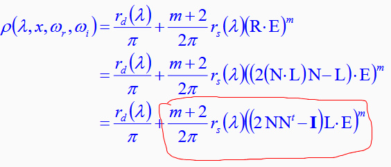

**2. Reziprozität:** statt einer festen Formel nimmt man eine beliebige
  **symmetrische Matrix M**.

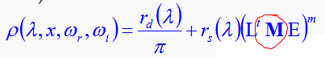

</details>

<details><summary>Transparency: Depth-Peeling (OIT)</summary>

Bei durchsichtigen Objekten muss man die Farben in der richtigen Reihenfolge
(von hinten nach vorne) blenden. Problem: Wenn sich Dreiecke gegenseitig durchdringen, gibt es
**keine einzige richtige Reihenfolge** für die Objekte als Ganzes.

Depth-Peeling sortiert deshalb nicht die Objekte, sondern **jeden Pixel
einzeln**:
- Jeder Render-Durchlauf findet die nächste Tiefenschicht
- Für *n* Schichten braucht man *n* Durchläufe
- Am Ende werden alle gefundenen Schichten von hinten nach vorne zusammengemischt

\+ Ergebnis ist immer korrekt, egal wie sich die Objekte überschneiden — Sortierung nicht nötig  
\- Sehr aufwendig: die ganze Szene wird mehrfach gezeichnet, dazu braucht man viele Zusatzspeicher (Buffer)

</details>

<details><summary>Transparency: Nebel</summary>

Vorteile:
- Realistischher Look
- spart Rechenleistung, da Objekte in der Ferne nicht mehr so detailliert gerendert werden müssen

Nachteile (z-Achse):
- **z nicht linear**: z-Wert nach perspektivischer Transformation ist nicht linear → muss für Nebelberechnung zurückgerechnet werden
- **z ≠ Entfernung**: z ist nur die Tiefe entlang der Blickachse, nicht die echte Distanz zum Auge → ggf. Umrechnung nötig ("Euclidean Distance Fog")
- **pro Vertex ungenau**: wie beim Gouraud Shading führt Nebel nur pro Vertex bei großen/schrägen Dreiecken zu Fehlern → besser "per pixel fog"

</details>

## 11 VL

<details><summary>Texturen: Inverse-Mapping-Problem</summary>

**Textur** = Bild, das auf ein 3D-Objekt "geklebt" wird. Einfach zu
denken ist die Richtung: *"dieser Punkt `(u,v)` auf dem Bild landet dort
`(x,y,z)` auf dem Objekt"* (`F_map`).

$$(r,g,b) = C_{tex}(u,v)$$

Eine 2D-Textur ist also eine Funktion, die Punkte `(u,v)` auf RGB-Farbwerte abbildet.

Beim Zeichnen kennt man aber schon den Punkt `(x,y,z)` auf der Oberfläche
und muss herausfinden, **welcher Bildpunkt `(u,v)` dort hingehört**, man
braucht also die Umkehrfunktion `F_invmap`. Für komplizierte Objektformen
lässt sich diese Umkehrung oft nicht einfach mit einer Formel berechnen,
das ist das **Inverse-Mapping-Problem**.

$$(u,v) = F_{invmap}(x,y,z)$$

Die Texturierung ist die Hintereinanderausführung beider Abbildungen:

$$(r,g,b) = C_{tex}\left(F_{invmap}(x,y,z)\right)$$

**Lösung:**
- einfache Grundkörper (Zylinder-, Kugel-, Box-Mapping) → analytisch bekannt
- komplexe Objekte → **Zweischrittverfahren** (Bier & Sloan): Objekt mit einfacher Hüllfläche umgeben → Texturkoordinaten davon auf Objekt übertragen

</details>

<details><summary>Texturen: 3D- / Prozedurale / Diskrete Texturen</summary>

- **3D-Textur**: Man stellt sich das Material als festen Block vor (z. B.
  Marmor) und "schneidet" das Objekt daraus heraus. Kein
  Aufkleben auf die Oberfläche nötig.  
	*+:* beliebig skalierbar, realistisch  
	*-:* braucht viel Speicher
- **Prozedurale Textur**: Es gibt gar kein gespeichertes Bild, sondern eine
  Formel, der die Farbe für jeden Punkt live berechnet.  
	*+:* wenig Speicher, beliebig skalierbar  
  *-:* eine gute Formel für komplizierte, realistische Muster zu
  finden ist sehr schwer.
- **Diskrete Textur**: ein ganz normales gespeichertes Bild (z. B. ein Foto),
  aus einzelnen Bildpunkten (Texeln).  
	*+:* einfach zu erstellen  
	*-:* braucht viel Speicher, unskalierbar

</details>

<details><summary>Texturen: Mipmapping</summary>

**Mipmapping** = Optimierungsmethode der 3D-Grafik, bei der die
Originaltextur im Voraus verkleinert und als eine Reihe von Kopien
(Mip-Stufen) unterschiedlicher Auflösung gespeichert wird.

**Wie es funktioniert**
- Beim Erstellen einer Textur erzeugt die
  Grafikkarte verkleinerte Kopien davon, wobei die Auflösung für jede
  weitere Stufe halbiert wird
- Je weiter ein Objekt in der Szene entfernt ist, desto kleiner ist die
  Mip-Stufe

**Vorteile von Mipmapping**
- Verbessert die Leistung der Grafikkarte (die GPU muss keine schweren Texturen für kleine Objekte laden)
- Glättet die Pixelierung und beseitigt starkes Rauschen auf Texturen, wenn sich das Objekt weit entfernt befindet

**Nachteile von Mipmapping**
- viel Speicher für zusätzliche Stufen
- gegen sichtbare Übergänge zwischen Mip-Stufen: **trilineare** oder **anisotrope Filterung**

</details>

<details><summary>Beeinflussung der Beleuchtung durch Texturen (8 Methoden)</summary>

Eine Textur kann an ganz unterschiedlichen Stellen in die Beleuchtungsrechnung eingreifen:

1. **Ersetzen** (`replace`) — Texturfarbe ersetzt komplett die Beleuchtung (einfachste Art): `L = C_tex(u,v)`  
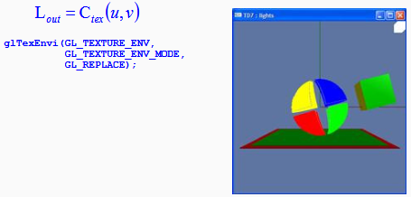

2. **A posteriori Skalierung** (`modulate`) — Beleuchtung wird mit Texturfarbe multipliziert (häufigste Art): `L = L_r · C_tex(u,v)`  
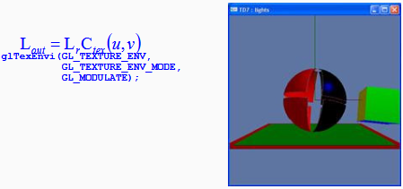

3. **A priori Skalierung der Materialfarbe** — ähnlich zu 2., aber spekularer Anteil bleibt unbeeinflusst  
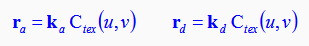

4. **Modulation der spekularen Reflexion** — analog zu 3., aber erlaubt Gestaltung unregelmäßiger Highlight (verschmutzte Flächen)  
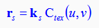

5. **Modulation der Transparenz** — ermöglicht Durchsichtigkeit (z.B. Glas, Wasser, Nebel)  
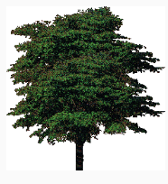

6. **Bump-Mapping** — Textur speichert Höhenwerte, deren Ableitungen die Flächennormale verändern → Ermöglicht komplexe Oberflächen mit einfacher Geometrie  
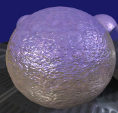

7. **Modulation von Lichtquellenparametern** — Textur moduliert Lichtfarbe/-intensität  
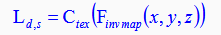

8. **Displacement-Mapping** — Veränderung der Geometrie  
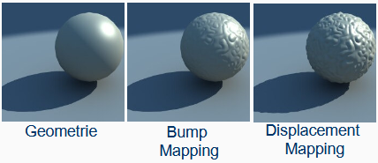

**Einschränkung:** Bei **Gouraud Shading** sind nur 1. und 2. möglich (Beleuchtung wird nur pro Vertex berechnet). 3.–7. brauchen **Phong Shading** (pro Pixel). 8. lässt sich nicht direkt in die Rasterisierung integrieren, da die Texturierung erst nach der Projektion erfolgt (braucht Tessellation vorher).

</details>

<details><summary>Texturierung komplexer Objektoberflächen (Zweischrittverfahren)</summary>

- Für komplexe Objekte ist es zu aufwendig, Texturkoordinaten für jeden Vertex von Hand zuzuweisen
- **Zweischrittverfahren** (Bier & Sloan, 1986):
  1. Objekt mit einfacher **virtueller Hüllfläche** umgeben (Zylinder, Kugel oder Quader) mit kanonischen Texturkoordinaten
  2. Diese Texturkoordinaten auf das umhüllte Objekt übertragen (z.B. entlang der Flächennormale projizieren)

- **Zylinder** (`φ,h`) / **Kugel** (`θ,φ`) / **Box** (längste/zweitlängste Achse) → `(u,v)`

</details>

<details><summary>Geometrische Schatten: Schattenvolumen</summary>

- **Schattenvolumen**: Bereich hinter einem Objekt (aus Sicht der Lichtquelle), begrenzt durch dessen Silhouette — liegt ein Punkt darin, liegt er im Schatten
- **Stencil-Buffer-Algorithmus**: Schattenpolygone zeichnen (nicht sichtbar) und dabei nur zählen — Rückseiten +1, Vorderseiten −1 → Zähler > 0 heißt "im Schatten". Danach Szene normal zeichnen, aber nur dort wo Zähler = 0
- **zPass/zFail**: zwei Varianten, wo gezählt wird (vor/hinter dem sichtbaren Punkt)

</details>

<details><summary>Geometrische Schatten: Shadow Mapping</summary>

- Idee: Tiefenbild aus Sicht der Lichtquelle rendern (Shadow Map). Punkt liegt im Schatten, wenn seine Tiefe (aus Lichtsicht) größer ist als der gespeicherte Wert
- Problem: **Aliasing** — nahe am Betrachter zu grob, in der Ferne zu fein (perspektivisch); bei flachem Lichteinfall generell ungenau (projektiv)
- **Perspective Shadow Maps** lösen nur das perspektivische Aliasing, nicht das projektive

</details>