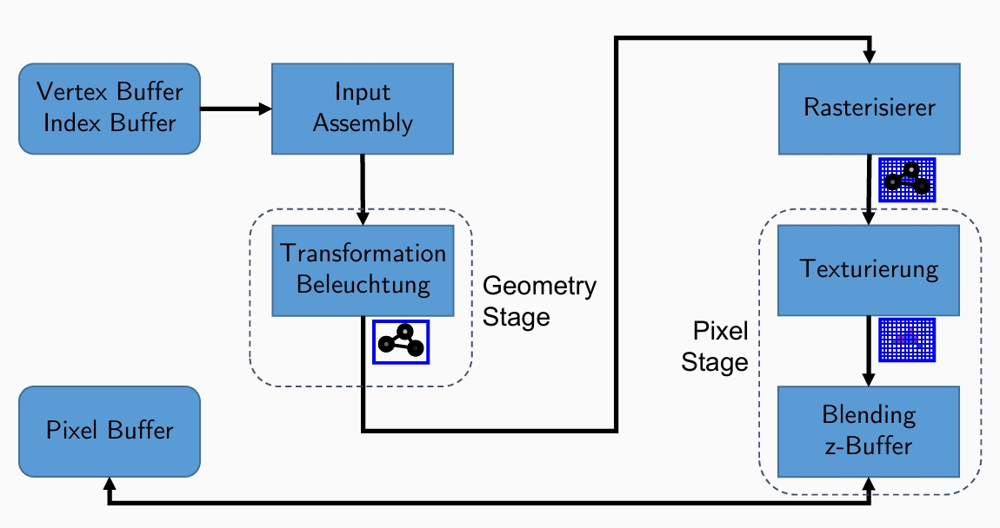
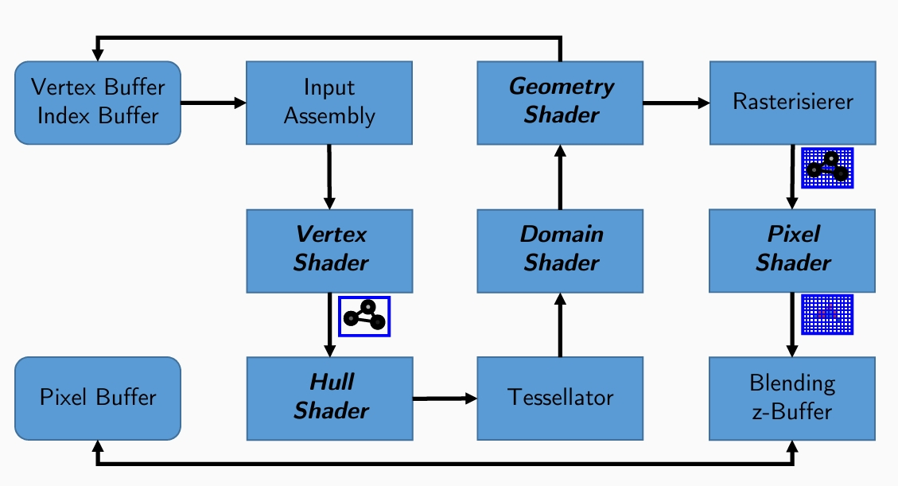
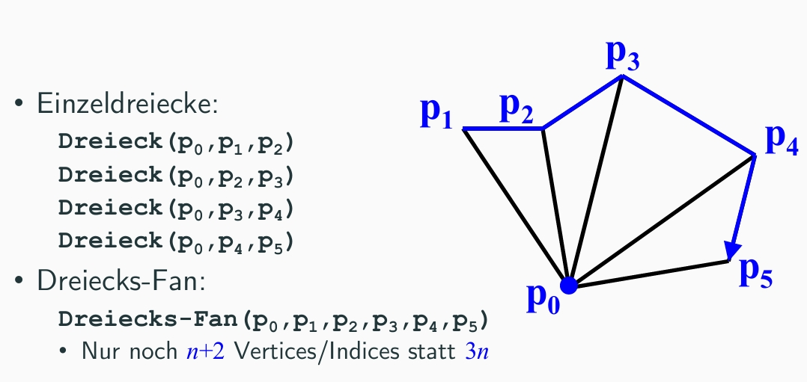
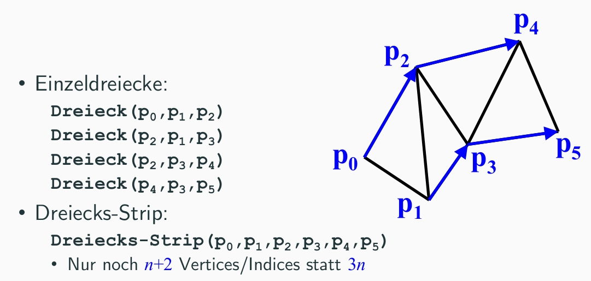
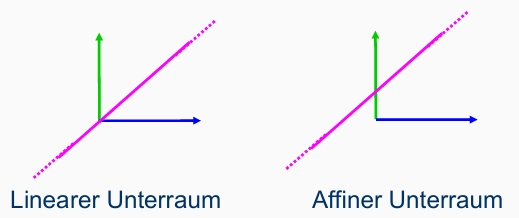
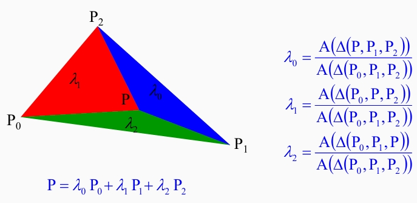
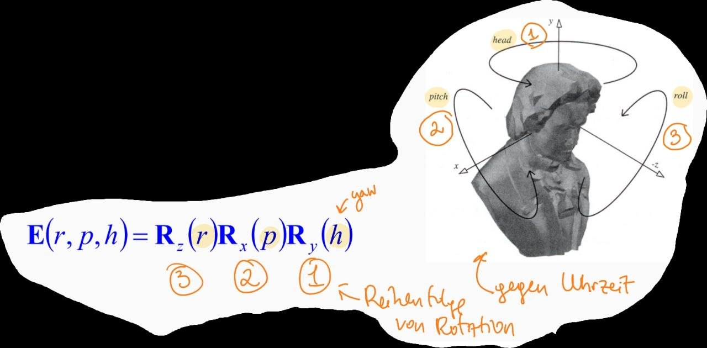

<details><summary>Drop Down Menu</summary>

- [x] Markdown-Notizen
- [ ] Weitere Notizen
- [ ] Noch mehr Notizen

- Punkt 1
- Punkt 2
- Punkt 3

1. Erster Punkt
2. Zweiter Punkt
3. Dritter Punkt

**fett**

_kursiv_

`inline code`

> Blockquote




[Google](https://www.google.com)

---

\*Это звездочка\*

```python
def hello_world():
		print("Hello, World!")
```

</details>

## 1 VL: Einführung in die Computergrafik

##### [Graphikpipeline](./vorlesungen/CG1-1.pdf)

<details><summary>Def: Rendering</summary>

**Rendering** = das Erzeugen von Bildern ausgehend von 3D- oder 2D-Modellen
</details>

<details><summary>klassische Pipeline: feste Schritte, nicht programmierbar</summary>


- **Vertex / Index Buffer** - Rohdaten: Punkte und Dreiecke des 3D-Objekts
- **Input Assembly** - Aus den Rohdaten werden Primitive (Dreiecke) zusammengesetzt
- **Transformation & Beleuchtung** - Objekt in die richtige Position bringen + Licht berechnen
- **Rasterisierer** - Primitive in Pixel umwandeln
- **Texturierung** - Pixel bekommen Farbe aus einer Textur
- **Blending / z-Buffer** - Tiefentest (was ist vorne/hinten?) + Transparenz
- **Pixel Buffer** - Fertiges Bild wird ausgegeben
</details>

<details><summary>modern Pipeline: programmierbar, flexibel, ermöglicht komplexe Effekte</summary>



- **Vertex Shader** - Vertices transformieren (programmierbar)
- **Hull Shader** - wie stark soll die Fläche unterteilt werden? (berechnen der Parameter für den Tessellator)
- **Tessellator** - Fläche automatisch in viele kleine Dreiecke aufteilen
- **Domain Shader** - neue Vertex-Positionen nach Unterteilung berechnen (verschieben des Vertices)
- **Geometry Shader** - Primitive erzeugen/verändern/löschen
- **Pixel Shader** - finale Farbe jedes Pixels berechnen (Licht, Texturen, Effekte)
</details>

##### [Einführung in die OpenGL](./vorlesungen/CG1-2.pdf)

<details><summary>OpenGL ist eine "State-Machine"</summary>

- OpenGL speichert Informationen über den aktuellen Zustand (z.B. welche Texturen gebunden sind, welche Shader aktiv sind, etc.)
- State-Informationen bleibt über mehrere Primitive gleich, was die Datenreduktion ermöglicht
</details>

<details><summary>Strips und Fans</summary>

**Strips und Fans** sind Möglichkeiten, Dreiecke **effizienter** zu speichern und zu rendern. Nur noch **n+2** Vertices/Indices statt **3n**

- **Fans** = ein zentraler Vertex, von dem aus Dreiecke ausgehen (gut für Kreise oder andere symmetrische Formen)
```OpenGL: GL_TRIANGLE_FAN
p0 = hub (центр)
Dreieck(p0, p1, p2)
Dreieck(p0, p2, p3)
Dreieck(p0, p3, p4)
```

- **Strips** = 2 Dreiecke teilen sich eine Seite, um eine lange Kette von Dreiecken zu bilden (gut für Boden, Wände, etc.)
```OpenGL: GL_TRIANGLE_FAN
Dreieck(p0, p1, p2)
Dreieck(p2, p1, p3)  ← два предыдущих + новая
Dreieck(p2, p3, p4)
```




</details>

## 2 VL: Primitives

##### [Koordinatensysteme | Transformationen | Projektionen](./vorlesungen/CG1-3.pdf)

<details><summary>Koordinatensysteme: affine und lineare</summary>



- **lineare Koordinatensysteme**:
  - nur Rotation, Skalierung, aber keine Translation
  - Ursprung bleibt fest
- **affine Koordinatensysteme**: 
  - zusätzlich Translation
  - Ursprung kann verschoben werden
  - ist ein Teilmenge der linearen Koordinatensysteme
</details>

<details><summary>Baryzentrische Koordinaten</summary>



- BK = Koordinatensystem, bei dem die Position eines Punktes **relativ zu den Ecken eines Dreiecks** angegeben wird, nicht in einem absoluten XY-System
- `P = α·A + β·B + γ·C`
- Die Koeffizienten `α, β, γ` sind die baryzentrischen Koordinaten.
- Bedingung: `α + β + γ = 1` und alle drei ≥ 0 (wenn P innerhalb liegt)
</details>

<details><summary>Affine Abbildungen</summary>

Eigenschaften von affinen Abbildungen:
- Gerade bleibt Gerade
- Parallele Objekte bleiben parallel
- Verhältnisse von Längen bleiben erhalten (z.B. Mittelpunkt bleibt Mittelpunkt)
- Beschränkte Objekte bleiben beschränkt

> Eine Abbildung ist genau dann affin, wenn sie aus einer linearen Abbildung und einer Translation (Verschiebung) besteht. `Ф(v) = A(v) + d` 
</details>

<details><summary>2D und 3D Transformationen</summary>

- **Translation in 2D**: Verschiebung eines Objekts um einen Vektor `t = (tx, ty)`
- **Translation in 3D**: ... `t = (tx, ty, tz)`
```T(tx, ty, tz) = [[1, 0, tx],
						 [0, 1, ty],
						 [0, 0, 1]]
```
- **Rotation in 2D**: Drehung eines Objekts um einen Winkel `θ` (gegen den Uhrzeigersinn)
```R(θ) = [[cos(θ), -sin(θ)],
				 [sin(θ),  cos(θ)]]
```
- **Rotation in 3D**: ... um eine Achse (x, y oder z) um einen Winkel `θ`
```Rz(θ) = [[cos(θ), -sin(θ), 0],
				 [sin(θ),  cos(θ), 0],
				 [0,       0,      1]]
```
	Problem: 
  1. zu klein oder zu großer Winkel kann zu numerischen Instabilitäten führen
  2. Gimbal Lock (Verlust einer Rotationsfreiheit)
- **Skalierung in 2D**: Vergrößerung oder Verkleinerung eines Objekts um Faktoren `sx` und `sy`
```S(sx, sy) = [[sx, 0],
						 [0, sy]]
```
- **Skalierung in 3D**: ... und `sz`
```S(sx, sy, sz) = [[sx, 0, 0],
								 [0, sy, 0],
								 [0, 0, sz]]
```
- **Shearing in 2D**: Verzerrung eines Objekts, z.B. horizontaler Shear mit Faktor `shx`
```Sh(shx) = [[1, shx],
						[0, 1]]
```
- **Shearing in 3D**:
```Sh(shx) = [[1, s3, s5],
						[s1, 1, s6],
						[s2, s4, 1]]
```
</details>

<details><summary>Roll-Pitch-Yaw</summary>



- in der Luftfahrt verwendet, um die Orientierung eines Flugzeugs zu beschreiben
- in OpenGL: 
	- **Roll** = z-Achse
	- **Pitch** = x-Achse
	- **Yaw/Head** = y-Achse
- `R = Rroll · Rpitch · Ryaw`. Die Reihenfolge ist umgekehrt zu der, in der die Rotationen angewendet werden (Yaw -> Pitch -> Roll)
	- [Крен, Тангаж, Рыскание](https://rcsearch.ru/wiki/%D0%9A%D1%80%D0%B5%D0%BD,_%D0%A2%D0%B0%D0%BD%D0%B3%D0%B0%D0%B6,_%D0%A0%D1%8B%D1%81%D0%BA%D0%B0%D0%BD%D0%B8%D0%B5)
</details>

<details><summary>Gimbal Lock</summary>

        - GL = wenn zwei Rotationsachsen in einer Linie liegen, **verliert man eine Rotationsfreiheit**
- z.B. wenn Pitch +-90° ist, dann liegen Roll und Yaw auf der selben Achse, man kann nicht mehr zwischen ihnen unterscheiden
- Problem bei der Verwendung von Euler-Winkeln für die Rotation (3D-Rotation)
- Lösung: **Quaternionen** (4D-Rotation)
</details>

